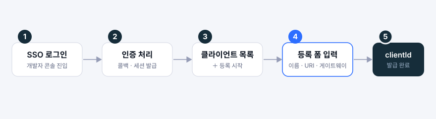
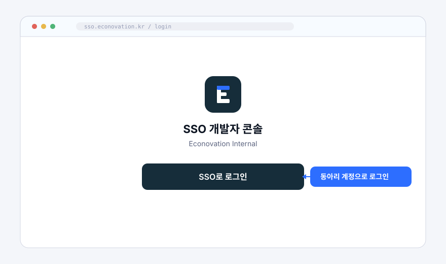
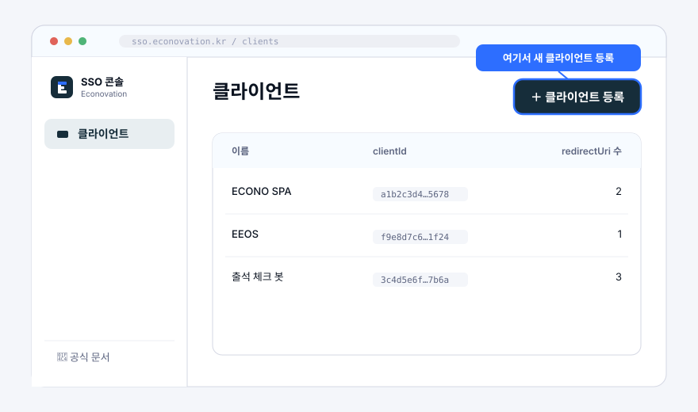
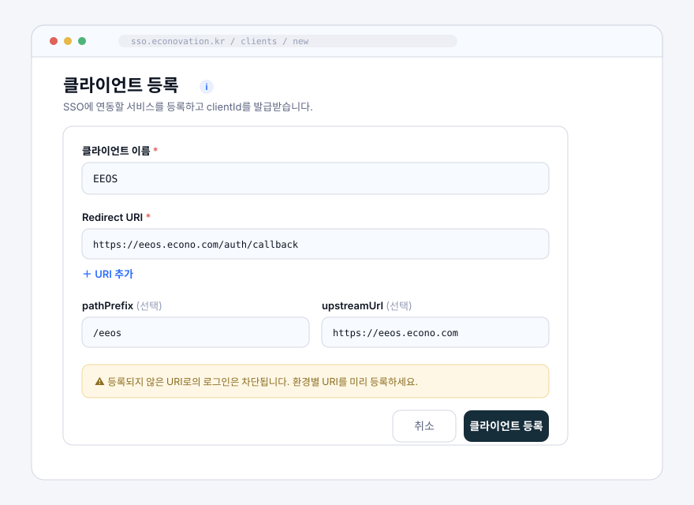
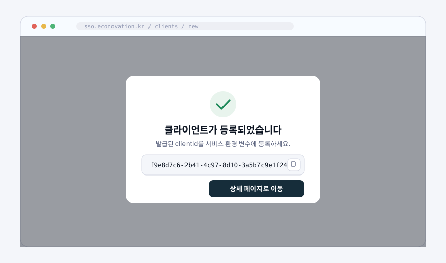
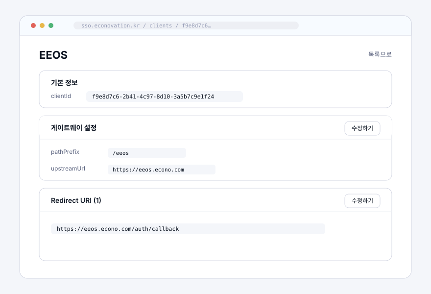

# 클라이언트 등록 가이드

개발자 콘솔에서 새 서비스를 SSO에 연동하려면 먼저 **클라이언트를 등록**해 `clientId`를 발급받아야 합니다. `clientId`는 SSO가 어느 서비스의 로그인 요청인지 식별하는 키입니다.

이 문서는 콘솔 로그인부터 클라이언트 등록, `clientId` 발급, 상세 페이지 관리까지의 절차를 화면 단위로 안내합니다. 이 절차를 마치면 `clientId`를 발급받아 SSO 연동을 시작할 수 있습니다.

## 전체 흐름

| 단계 | 화면            | 하는 일                                     |
| ---- | --------------- | ------------------------------------------- |
| 1    | 로그인          | 동아리 계정으로 개발자 콘솔에 진입          |
| 2    | 인증 처리       | SSO 콜백 처리 후 세션 발급 (자동)           |
| 3    | 클라이언트 목록 | `클라이언트 등록` 버튼으로 등록 시작        |
| 4    | 등록 폼         | 이름 · Redirect URI · 게이트웨이 설정 입력  |
| 5    | 발급 완료       | `clientId` 발급 → 상세 페이지에서 확인·관리 |

## 1. SSO 로그인하기

개발자 콘솔(`/login`)에 접속해 **`SSO로 로그인`** 버튼을 누릅니다. 동아리 SSO 계정으로 인증합니다. 콜백 처리가 끝나면 자동으로 클라이언트 목록으로 이동합니다.

## 2. 클라이언트 등록 시작하기

목록 화면(`/clients`)에서 우측 상단의 **`＋ 클라이언트 등록`** 버튼을 누릅니다. 이미 등록된 클라이언트는 이름·`clientId`·redirectUri 수와 함께 테이블로 표시됩니다.

## 3. 등록 폼 입력하기

등록 폼(`/clients/new`)에서 아래 항목을 입력합니다.

| 항목                | 필수 | 설명                                                                                     |
| ------------------- | :--: | ---------------------------------------------------------------------------------------- |
| **클라이언트 이름** |  ✅  | 서비스를 식별하는 표시용 이름 (예: `EEOS`)                                               |
| **Redirect URI**    |  ✅  | 인증 결과를 돌려받을 콜백 주소. `＋ URI 추가`로 환경별(운영·개발·로컬) 여러 개 등록 가능 |
| **pathPrefix**      |  ⬜  | 게이트웨이가 이 서비스로 요청을 라우팅할 때 쓰는 경로 접두사 (예: `/api/eeos`)           |
| **upstreamUrl**     |  ⬜  | 요청이 실제로 전달되는 오리진 주소 (예: `https://eeos.econo.com`)                        |

입력을 마치면 **`클라이언트 등록`** 버튼을 눌러 제출합니다.

> `pathPrefix`·`upstreamUrl`은 게이트웨이 라우팅 설정값입니다. 두 값의 의미와 동작은 [API Gateway 동작 원리](./gateway)에서 확인하세요.

## 4. clientId 발급받기

등록에 성공하면 발급된 **`clientId`**가 표시됩니다. 이 값은 SSO가 어느 서비스의 로그인 요청인지 식별하는 키이므로, **연동 서비스의 환경 변수에 등록**하세요.

## 5. 상세 페이지 관리하기

`상세 페이지로 이동`을 누르면 클라이언트 상세 화면(`/clients/:clientId`)으로 이동합니다. 여기서 등록 내용을 다시 확인하고 관리할 수 있습니다.

- **기본 정보** — 발급된 `clientId` 확인 및 복사
- **게이트웨이 설정** — `upstreamUrl` 수정 가능. `pathPrefix`는 라우팅 식별자로 **등록 후 변경 불가**(읽기 전용)
- **Redirect URI** — `수정하기`로 URI를 추가·삭제·전체 교체. 변경 내용은 적용 전 diff로 다시 확인

## 다음으로

발급된 `clientId`와 Redirect URI를 연동 서비스 코드에 설정하면 SSO 로그인이 동작합니다.

- [Quick Start](./quick-start) — 가장 단순한 웹 서비스 연동을 세 단계로
- [SSO 동작 들여다보기](./sso-integration) — 전체 흐름·쿼리 파라미터·로그인 후 리다이렉트 상세
- [API Gateway 동작 원리](./gateway) — `pathPrefix`·`upstreamUrl` 라우팅 설정의 의미
