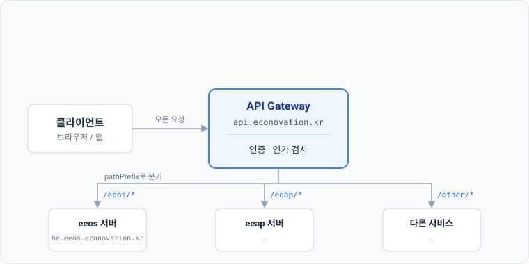
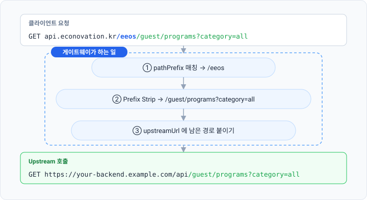
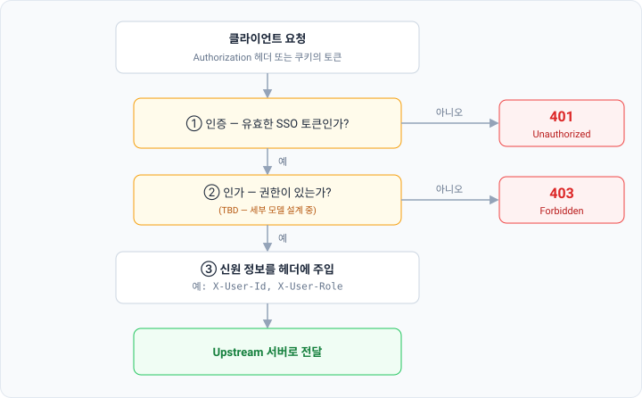
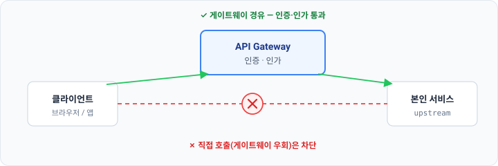

# API Gateway 동작 원리

에코노베이션 API Gateway는 모든 서비스 요청이 거치는 단일 진입점으로, 라우팅과 인증·인가를 한곳에서 처리합니다.

모든 요청이 이 단일 진입점을 반드시 거치기 때문에, 게이트웨이는 SSO 토큰을 검증하고 권한을 확인한 뒤에야 upstream으로 통과시킵니다.

이 문서를 읽고 나면 에코노베이션 API Gateway의 라우팅·경로 재작성·인증·인가 처리 방식을 이해한 뒤, 어드민 콘솔에서 서비스를 직접 등록할 수 있습니다. 등록 절차만 빠르게 보려면 [서비스 등록하기](#서비스-등록하기) 섹션으로 바로 이동하세요.

## 게이트웨이 개요

클라이언트(브라우저, 앱)는 `api.econovation.kr` 하나만 알면 됩니다. 실제 백엔드 서버 주소는 클라이언트에 노출되지 않습니다. 게이트웨이가 모든 요청을 받아 해당 서비스로 전달합니다.



게이트웨이가 하는 일은 크게 세 가지입니다.

1. **라우팅** — 요청 경로를 보고 어느 서버로 보낼지 결정합니다.
2. **경로 재작성** — upstream 서버에 맞게 경로를 변환합니다.
3. **인증·인가** — SSO 토큰을 검증하고 권한을 확인한 뒤, 통과한 요청에는 신원 정보를 헤더에 담아 upstream으로 전달합니다.

클라이언트가 단일 진입점만 안다는 점, 게이트웨이가 요청을 전달하기 전에 인증·인가를 처리한다는 점이 핵심입니다.

## 라우팅 규칙

게이트웨이의 라우팅 단위는 **라우트(Route)** 한 줄입니다. 라우트는 두 가지 핵심 값으로 이루어집니다.

| 필드 | 역할 | 예시 |
| --- | --- | --- |
| `pathPrefix` | 요청 경로가 이 값으로 시작하는지 매칭합니다. | `/eeos` |
| `upstreamUrl` | 매칭된 요청을 보낼 목적지 서버 주소입니다. | `https://be.eeos.econovation.kr/api` |

요청이 들어오면 게이트웨이는 등록된 라우트 중에서 `pathPrefix`가 경로 앞부분과 일치하는 라우트를 찾습니다. 일치하는 라우트가 없으면 게이트웨이가 `404`를 반환합니다.

`pathPrefix`가 여러 개 겹쳐 매칭될 때는 **가장 긴 prefix가 우선**합니다. 예를 들어 `/eeos`와 `/eeos/admin`이 모두 등록돼 있고 요청이 `/eeos/admin/users`로 들어오면, 더 구체적인 `/eeos/admin` 라우트가 선택됩니다.

## 경로 재작성 (Prefix Strip)

게이트웨이는 요청 경로를 그대로 upstream에 넘기지 않습니다. 경로에서 `pathPrefix` 부분을 떼어낸(strip) 뒤, 남은 경로를 `upstreamUrl` 뒤에 붙여 최종 URL을 만듭니다.



1. 클라이언트가 `api.econovation.kr/eeos/guest/programs?category=all`로 요청합니다.
2. 게이트웨이가 `/eeos` prefix와 매칭합니다.
3. 경로에서 `/eeos`를 떼어내면 `/guest/programs?category=all`이 남습니다.
4. `upstreamUrl`(`https://be.eeos.econovation.kr/api`)에 남은 경로를 붙여 `https://be.eeos.econovation.kr/api/guest/programs?category=all`로 요청합니다.

> `pathPrefix`로 잡히는 `/eeos`는 **게이트웨이 안에서만 쓰이는 네임스페이스**입니다. upstream 서버는 `/eeos`가 무엇인지 알 필요가 없습니다. 게이트웨이가 어느 서비스로 보낼지 식별하는 용도일 뿐이며, upstream에 도달할 때는 이미 제거되어 있습니다. upstream 서버의 API 경로 체계는 게이트웨이와 무관하게 그대로 유지하면 됩니다.

## 인증과 인가

게이트웨이는 단순한 트래픽 중계기가 아니라 **정책 시행 지점(Policy Enforcement Point, PEP)** 입니다. SSO가 발급한 토큰의 유효성을 검증하고(인증), 요청에 권한이 있는지 확인한(인가) 뒤에야 upstream으로 전달합니다.



검사를 통과한 요청에는 사용자 신원 정보가 헤더로 주입됩니다. upstream 서버는 이 헤더로 사용자를 식별할 수 있으므로, **upstream 서버가 직접 토큰을 파싱하거나 SSO와 통신할 필요가 없습니다.** 토큰 검증은 게이트웨이가 한곳에서 처리하므로, upstream 서버는 비즈니스 로직에만 집중할 수 있습니다.

라우트마다 `authRequired` 값으로 인증 요구 여부를 정할 수 있습니다. 공개 API나 헬스체크처럼 토큰 없이 열어 두어야 하는 경로는 `authRequired`를 `false`로 설정합니다. 이때도 요청은 게이트웨이를 경유하지만, 인증·인가 검사는 건너뜁니다. 검사를 건너뛴 요청에는 신원 정보 헤더(`X-User-Id` 등)가 주입되지 않습니다.

> **인가 세부 모델은 아직 확정되지 않았습니다(TBD).** 클라이언트 단위 접근 제어, 역할(role), 스코프(scope) 기반 권한 모델은 현재 설계 중입니다. 모델이 확정되면 이 섹션과 아래 라우트 스키마를 보완할 예정입니다. 지금은 "게이트웨이가 권한을 판단해 통과 여부를 결정한다"는 수준으로 이해하면 충분합니다.

### 모든 요청은 게이트웨이를 거쳐야 합니다

요청을 보내는 주체는 클라이언트(브라우저, 앱)입니다. 클라이언트가 게이트웨이로 요청을 보내면, 게이트웨이가 인증·인가를 처리한 뒤 upstream 서버로 전달합니다. 그래서 upstream 서버는 토큰을 직접 검증하지 않고, 게이트웨이가 통과시킨 요청만 받습니다.

이 구조는 **모든 요청이 게이트웨이를 거친다는 전제**에서만 안전합니다. upstream 서버가 외부에 직접 노출되어 클라이언트가 게이트웨이를 건너뛰고 호출할 수 있으면, 그 요청은 인증·인가를 거치지 않은 채 서비스에 도달합니다.



따라서 게이트웨이를 우회하는 경로를 다음 중 한 가지 방법으로 막아야 합니다.

- upstream 서버를 외부에 직접 노출하지 않고, 게이트웨이만 공개합니다(내부망 또는 방화벽으로 차단).
- 또는 upstream 서버가 게이트웨이를 거친 요청만 받도록, 게이트웨이가 붙인 신뢰 헤더나 서명을 검증합니다.

## 서비스 등록하기

다음 절차에 따라 어드민 콘솔에서 서비스를 등록합니다.

### 사전 조건

- 에코노베이션 어드민 콘솔 접근 권한
- SSO에 등록된 `clientId` (아직 없다면 [Quick Start](./quick-start)에서 발급)
- upstream 서버의 공개 URL (예: `https://be.eeos.econovation.kr/api`)

### 1. 라우트 추가 열기

어드민 콘솔에서 **Gateway → Routes → 라우트 추가**를 선택합니다.

### 2. 라우트 정보 입력

| 필드 | 설명 | 예시 | 제약 |
| --- | --- | --- | --- |
| `pathPrefix` | 게이트웨이 진입 경로입니다. 다른 라우트와 중복할 수 없습니다. | `/eeos` | 슬래시(`/`)로 시작, 중복 불가 |
| `upstreamUrl` | 요청을 전달할 서버 주소입니다. 끝에 슬래시(`/`) 없이 입력합니다. | `https://be.eeos.econovation.kr/api` | HTTPS 권장 |
| `stripPrefix` | Prefix Strip 적용 여부입니다. 기본으로 `true`로 설정합니다. | `true` | — |
| `authRequired` | 인증 필요 여부입니다. 공개 API가 아니면 `true`로 설정합니다. | `true` | — |
| `enabled` | 라우트 활성화 여부입니다. 등록 즉시 트래픽을 받으려면 `true`로 설정합니다. | `true` | — |
| `allowedScopes` | 허용할 스코프 목록. *(TBD — 인가 모델 확정 후 반영)* | — | — |

`clientId`는 라우트를 입력하는 화면에서 현재 선택된 클라이언트로 자동 지정됩니다. 라우트가 어느 SSO 클라이언트에 귀속되는지를 나타내며, 하나의 `clientId`에 여러 라우트를 등록할 수 있습니다.

등록할 라우트의 전체 필드 구성은 다음과 같습니다.

```jsonc
{
  "clientId": "eeos-client-uuid",   // 자동 지정 — 이 라우트의 소유 클라이언트
  "pathPrefix": "/eeos",            // 유일해야 함
  "upstreamUrl": "https://be.eeos.econovation.kr/api",
  "stripPrefix": true,
  "authRequired": true,
  "enabled": true,
  "allowedScopes": []               // TBD — 인가 모델 확정 후
}
```

### 3. 저장 및 확인

저장하면 라우트 목록에 항목이 추가됩니다. `enabled`가 `true`이면 즉시 트래픽을 받습니다. 등록한 `pathPrefix`로 요청을 보내 정상 동작을 확인합니다.

```bash
# pathPrefix를 /eeos 로 등록한 경우
curl -H "Authorization: Bearer <access_token>" \
     https://api.econovation.kr/eeos/healthz
```

upstream 서버가 정상 응답을 반환하면 등록이 완료된 것입니다.

## 자주 묻는 질문

**upstream 서버의 API 경로 앞에 `/eeos`를 붙여야 하나요?**

아니요. Prefix Strip이 적용되어 upstream 서버에는 `/eeos` 없이 요청이 도달합니다. `pathPrefix`는 게이트웨이 내부 네임스페이스이므로, upstream 서버의 API 경로는 그대로 유지하면 됩니다.

**`pathPrefix`가 다른 서비스와 겹치면 어떻게 되나요?**

`pathPrefix`는 라우트 전체에서 유일해야 합니다. 콘솔에서 이미 등록된 prefix로 다시 등록하면 오류가 발생합니다. 먼저 등록한 라우트가 그 prefix를 선점합니다.

**인증이 필요 없는 공개 엔드포인트는 어떻게 처리하나요?**

해당 라우트의 `authRequired`를 `false`로 설정하면 토큰 없이도 요청이 통과됩니다. 단, 이 경우에도 요청은 게이트웨이를 경유합니다.

**upstream 서버에서 사용자 정보는 어떻게 알 수 있나요?**

게이트웨이가 인증을 통과시킨 요청에는 신원 정보를 헤더(예: `X-User-Id`)로 주입합니다. upstream 서버는 토큰을 직접 검증하지 않고 이 헤더를 읽어 사용자를 식별합니다.

## 관련 문서

- [Quick Start](./quick-start) — `clientId` 발급과 SSO 연동 절차
- [SSO 동작 들여다보기](./sso-integration) — SSO 토큰 발급·재발급 원리
